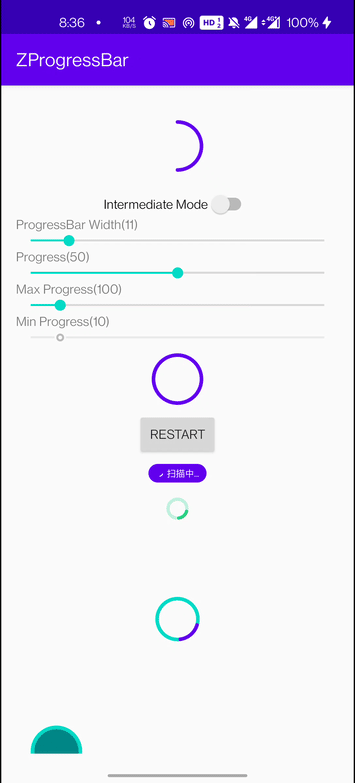

# ZProgressBar
 A customized Android ProgressBar.

 

## Install

#### Latest Version：[](https://jitpack.io/#Z-P-J/ZProgressBar)
```groovy
implementation 'com.zpj.progressbar:ZProgressBar:latest_version'
```

## How to use?
 
```xml
<com.zpj.progressbar.ZProgressBar
            android:layout_width="match_parent"
            android:layout_height="wrap_content"
            android:padding="8dp"
            app:zbp_radius="12dp"
            app:zbp_border_color="#c0f2d9"
            app:zbp_progress_bar_width="3.5dp"
            app:zbp_intermediate_mode="true"
            app:zbp_progress_bar_color="#2ad181"
            />
```

### Attrs
```xml
<declare-styleable name="ZProgressBar">
        <!--ProgressBar进度-->
        <attr name="zbp_progress" format="integer" />
        <!--ProgressBar最大进度，默认为100-->
        <attr name="zbp_max_progress" format="integer" />
        <!--ProgressBar最小进度，默认为10，仅在intermediate模式下有效-->
        <attr name="zbp_min_progress" format="integer" />
        <!--圆形ProgressBar半径，默认20dp-->
        <attr name="zbp_radius" format="dimension" />
        <!--ProgressBar背景色，默认透明-->
        <attr name="zbp_background_color" format="color" />
        <!--ProgressBar边框粗细，默认和zbp_progress_bar_width相等-->
        <attr name="zbp_border_width" format="dimension" />
        <!--ProgressBar边框颜色，默认透明-->
        <attr name="zbp_border_color" format="color" />
        <!--ProgressBar粗细，默认4dp-->
        <attr name="zbp_progress_bar_width" format="dimension" />
        <!--ProgressBar颜色，默认为colorPrimary-->
        <attr name="zbp_progress_bar_color" format="color" />
        <!--intermediate模式，是否精确显示，false表示精确显示进度，true表示不精确显示进度-->
        <attr name="zbp_intermediate_mode" format="boolean" />
        <!--进度文字颜色，默认黑色-->
        <attr name="zbp_progress_text_color" format="color" />
        <!--进度文字大小，默认自动适应文字大小-->
        <attr name="zbp_progress_text_size" format="dimension" />
        <!--是否显示进度文字，在非intermediate模式下有效-->
        <attr name="zbp_show_progress_text" format="boolean" />
</declare-styleable>
```